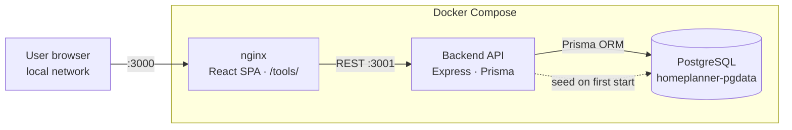

# Architecture

Three Docker services — frontend, API, and database — run on the home network via docker-compose. The frontend is a static React SPA served by nginx; it talks to the backend over a plain REST API; the backend persists everything in Postgres. The Manual J calculator is a self-contained HTML file served by the same nginx instance, loaded in an iframe by the Tools page.

## Components

**User browser (local network):** Any device on the home network. No authentication — the app is intentionally LAN-only. Port 3000 is the only entry point exposed to the network; port 3001 (API) and 5432 (Postgres) are internal to Docker.

**nginx / React SPA:** The frontend container builds the React/Vite app and serves the static bundle with nginx. It also serves the `public/` directory, which includes `tools/manual-j.html` — the Manual J calculator's standalone HTML file. The nginx config proxies nothing; the React app calls the API directly via the Docker-published port 3001.

**Backend API (Express + Prisma):** A Node.js/Express server with seven route groups: settings, projects, backlog, benchmarks, home value, tasks, and export. Prisma handles all database access. On startup, the server checks whether the `RoiBenchmark` table is empty and runs the seed script if so — this means a fresh deployment is usable immediately without a separate migration step.

**PostgreSQL (homeplanner-pgdata):** Stores five entities: `Settings` (singleton row with home value and location), `Project`, `BacklogItem`, `RoiBenchmark` (seeded), `HomeValueSnapshot` (time-series log), and `Task` (sub-tasks linked to a project with cascading delete). Data persists in a named Docker volume. The docker-compose health check gates the backend on Postgres being ready before it starts.

## Data flow

Primary use case: user adds a project and views projected home value.

1. The browser connects to nginx on port 3000. nginx serves the built React bundle.
2. The Dashboard component fetches `/api/settings`, `/api/projects`, `/api/homevalue`, and `/api/tasks` in parallel on mount.
3. The API queries Postgres via Prisma and returns JSON. On first run, the API seeds 22 ROI benchmark categories before serving any requests.
4. The user opens the project form and selects a category (e.g. "Minor Kitchen Remodel"). The frontend fetches `/api/benchmarks`, matches the category, and pre-fills the ROI percentage field (96% in this case).
5. The user saves the project. The frontend POSTs to `/api/projects`; the backend creates the record in Postgres and returns it.
6. The Dashboard recalculates `sum(cost × roi%)` across all projects client-side and updates the projected home value display — no second server round-trip needed.

Secondary use case: Manual J heat load calculation.

1. The user navigates to Tools → Manual J. The React app renders an `<iframe src="/tools/manual-j.html">`.
2. nginx serves the standalone HTML file. All calculation state lives in JavaScript variables within that page — no API calls, no persistence.
3. The user fills in climate, envelope, windows, infiltration, internal gains, and equipment fields. The calc engine (`calcZone`) runs on every input event and updates the live results panel.
4. In zone-by-zone mode, each zone's inputs are independent; the summary page aggregates all zones and flags equipment sizing ratios above 1.35× as potentially oversized.

## Decisions

- **Why self-contained Docker Compose over a cloud deployment:** This is personal financial data (home value, project costs) that has no reason to leave the home network. LAN-only also eliminates the need for an authentication layer.
- **Why Postgres over SQLite:** The home value snapshot table is a time series that benefits from indexed `createdAt` ordering; Prisma's cascading delete for tasks (when a project is deleted) is cleaner with a server-side constraint than with SQLite triggers. `pg_dump` also makes backups trivial to script.
- **Why a standalone HTML file for Manual J:** The calculator has its own 3-column desktop layout, mobile bottom navigation, step-progress bar, and slide-up drawers — a UI structure that doesn't fit within the parent SPA's single-column component model. An iframe boundary keeps the two entirely independent; the calculator can be opened directly in a browser tab without the SPA loaded at all.
- **Why ROI benchmarks as database rows, not hardcoded constants:** Storing them in Postgres leaves the door open to per-region customization or user overrides without a code change. The seed script uses `upsert`, so re-running it is safe and idempotent.
